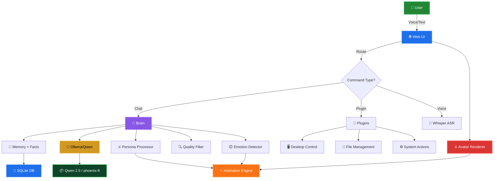

<div align="center">


```
╔══════════════════════════════════════════════════════════════╗
║                                                              ║
║  ██████╗ ██╗  ██╗ ██████╗ ███████╗███╗   ██╗██╗██╗  ██╗      ║
║  ██╔══██╗██║  ██║██╔═══██╗██╔════╝████╗  ██║██║╚██╗██╔╝      ║
║  ██████╔╝███████║██║   ██║█████╗  ██╔██╗ ██║██║ ╚███╔╝       ║
║  ██╔═══╝ ██╔══██║██║   ██║██╔══╝  ██║╚██╗██║██║ ██╔██╗       ║
║  ██║     ██║  ██║╚██████╔╝███████╗██║ ╚████║██║██╔╝ ██╗      ║
║  ╚═╝     ╚═╝  ╚═╝ ╚═════╝ ╚══════╝╚═╝  ╚═══╝╚═╝╚═╝  ╚═╝      ║
║                                                              ║
║        LOCAL AI • MEMORY • VOICE • VISION • AGENT            ║
║                                                              ║
╚══════════════════════════════════════════════════════════════╝
```

### 🐦‍🔥 A Living AI Companion, Not A Chatbot

*Chat. Feel. Remember. **Execute.***

<br/>


<br/>

**No subscriptions. No cloud. No telemetry.**

Phoenix runs entirely on your machine—brain, eyes, voice, and avatar.

It's not asking for permission. It's becoming part of your desktop.

<br/>

</div>

---

<div align="center">

## 🎯 The Vision

</div>

Phoenix is an experiment in creating a **digital being** that lives on your machine.

Not an app in a browser tab. Not an API you call. **An entity.**

It watches. It listens. It remembers. It acts.

The 3D cyber samurai avatar is not decorative—it is the **embodiment** of Phoenix's agency. When you ask it to do something, you see it do it.

```
Your command
    ↓
Phoenix understands
    ↓
Samurai moves toward action
    ↓
System executes
    ↓
Avatar performs triumphant gesture
```

---

<div align="center">

## ✨ Core Mechanics

</div>

<table>
<tr>
<td width="50%">

**🧠 Intelligent Brain**
- Ollama + Qwen local LLM
- Emotion detection & adaptation
- Context-aware memory system
- Task planning & execution
- No external API dependency

**🗣️ Voice First**
- Local speech recognition (Whisper)
- Natural conversation flow
- Wake word detection *(planned)*
- Multi-language support *(planned)*

**💾 Living Memory**
- SQLite conversation history
- Automatic fact extraction
- Session isolation
- User profile building

</td>
<td width="50%">

**⚔️ Avatar Is Core**
- Not decoration—agent embodiment
- Real-time emotion animation
- Action visualization
- Idle/thinking/listening states
- Personality through movement

**🖥️ Desktop Integration** *(Emerging)*
- Application control
- File management
- System automation
- Screen awareness
- Intent execution

**🔌 Plugin Ecosystem**
- Extensible command system
- Drop-and-go architecture
- Full session context
- Chat commands + desktop commands

</td>
</tr>
</table>

---

<div align="center">

## 📊 Feature Matrix

</div>

| Feature | Status | Phase |
|:--------|:-------|:------|
| Local AI inference | ✅ | 1 |
| Emotion detection | ✅ | 1 |
| Memory + facts | ✅ | 1 |
| Voice input (Whisper) | ✅ | 3 |
| Avatar rendering | ✅ | 3 |
| Plugin system | ✅ | 4 |
| Fine-tuning pipeline | ✅ | 4 |
| **Avatar animations** | 🔄 | 5 |
| **Idle behaviors** | 🔄 | 5 |
| **Desktop automation** | 📋 | 6 |
| **Screen understanding** | 📋 | 7 |
| **Autonomous task planning** | 📋 | 8 |

---

<div align="center">

## ⚡ Quick Start

</div>

### Prerequisites

```bash
# Install Ollama (https://ollama.ai)
# Install Python 3.10+
# Optional: faster-whisper for voice
```

### Setup

```bash
# 1. Clone & install
git clone https://github.com/youruser/phoenix.git
cd phoenix
pip install -r requirements.txt

# 2. Pull a model
ollama pull qwen2.5        # Recommended (4GB, fast)
# OR for better reasoning:
# ollama pull qwen2.5:14b  # 9GB, more capable

# 3. Run Phoenix
python main.py
```

**Output:**
```
╔════════════════════════════════════════════╗
║          Phoenix Awakens                   ║
║        Ollama Brain: Ready                 ║
║        Model: qwen2.5                      ║
║        Avatar: Loaded                      ║
║        Plugins: /joke /calc /remind        ║
║                                            ║
║     → Visit: http://localhost:5000         ║
╚════════════════════════════════════════════╝
```

---

<div align="center">

## 🎮 How It Works

</div>

### Example: Opening Spotify

```
You: "Play some music"
  ↓
Phoenix detects intent + emotion
  ↓
Memory loads context
  ↓
Emotion detector: happy, energetic
  ↓
Samurai performs AWAKENING animation
  ↓
Desktop automation finds Spotify
  ↓
Application opens
  ↓
Samurai performs TRIUMPHANT gesture
  ↓
Phoenix: "Already ahead of you! 🎵"
```

### Example: Answering a Question

```
You: "What's my name?"
  ↓
Memory lookup finds "Alex"
  ↓
Emotion analysis: curious
  ↓
Samurai tilts head, THINKING animation
  ↓
Phoenix responds naturally
  ↓
Avatar performs satisfied nod
```

---

<div align="center">

## 📁 Architecture

</div>



---

<div align="center">

## ⚔️ Avatar Animation System

</div>

Phoenix's avatar doesn't just render—it **performs**.

### Emotion States

```
😊 HAPPY        → Bouncing idle, head tilts, sword gleams
😢 SAD          → Drooped posture, slow sway, dim lighting
😠 ANGRY        → Aggressive stance, rapid breathing, glowing eyes
😟 ANXIOUS      → Fidgeting, pacing, flickering aura
🤔 CONFUSED     → Head tilt cycles, uncertain stance
```

### Action States

```
🎤 LISTENING    → Head focused, ear toward user, gentle glow
💭 THINKING     → Pacing with sword raised, particle effects
⚡ EXECUTING    → Rapid movement, dramatic pose, energy burst
🏆 SUCCESS      → Victory gesture, explosion of light particles
❌ ERROR        → Defensive stance, red warning aura
```

### Idle Behaviors *(Phase 5)*

```
- Breathing cycles (chest rise/fall)
- Sword spinning patterns
- Ambient particle effects
- Microexpressions (blinks, glances)
- Meditation poses
```

---

<div align="center">

## 🔮 Roadmap: Toward Autonomy

</div>

### Phase 1-4: Foundation ✅
- Local AI brain
- Emotion system
- Memory persistence
- Voice I/O
- Plugin system
- Basic avatar

### **Phase 5: Avatar Comes Alive** 🔄
- ✅ Emotion-driven animations
- 🔄 Idle behavior loops
- 🔄 Thinking/listening states
- 🔄 Action visualization
- 📋 Dynamic particle effects
- 📋 Real-time gesture sync

**Goal:** Avatar becomes emotionally expressive, not static.

### **Phase 6: Desktop Integration** 📋
- Application launcher + control
- File system navigation
- Volume/brightness control
- Window management
- Keyboard/mouse automation
- Intent-based execution

**Goal:** Samurai walks toward what it controls.

### **Phase 7: Computer Vision** 📋
- Screen capture + analysis
- UI element detection
- Object recognition
- Icon identification
- Real-time scene understanding
- Context-aware decisions

**Goal:** Phoenix sees what you see.

### **Phase 8: Autonomous Agent** 📋
- Task planning (multi-step)
- Goal decomposition
- Self-directed actions
- Error recovery
- Learning from execution
- Proactive assistance

**Goal:** Phoenix doesn't wait to be asked.

---

<div align="center">

## 📚 Usage

</div>

### Chat Commands

```
/reset      Clear session memory
/facts      Show learned facts about you
/memory     View recent turns
/stats      Database statistics
exit        Quit Phoenix
```

### Plugin Commands

```
/joke                              Random AI/programming joke
/calc (12 * 3) / sqrt(9)          Safe math evaluator
/remind dentist tomorrow 6pm       Save reminder
/remind list                       View all reminders
/remind clear                      Clear reminders
```

### Voice Input *(requires faster-whisper)*

```bash
# Install
pip install faster-whisper

# Set model size (tiny|base|small)
WHISPER_MODEL=small python main.py

# Send audio to /voice endpoint
curl -X POST http://localhost:5000/voice -F "audio=@recording.wav"
```

---

<div align="center">

## 🧬 Configuration

</div>

Override via environment variables:

| Variable | Default | Purpose |
|:---------|:--------|:--------|
| `OLLAMA_HOST` | `http://localhost:11434` | Ollama server |
| `OLLAMA_MODEL` | `qwen2.5` | Model to use |
| `PHOENIX_SECRET` | *(random)* | Flask session key |
| `WHISPER_MODEL` | `tiny` | Voice transcription |
| `ANIMATION_SPEED` | `1.0` | Avatar animation multiplier *(planned)* |
| `EMOTION_INTENSITY` | `1.0` | Avatar expression intensity *(planned)* |

```bash
OLLAMA_MODEL=qwen2.5:14b WHISPER_MODEL=small python main.py
```

---

<div align="center">

## 🤖 Supported Models

</div>

| Model | Best For | VRAM | Speed |
|:------|:---------|:-----|:------|
| `qwen2.5` | Everyday chat | 4 GB | Fast ⚡ |
| `qwen2.5:14b` | Complex reasoning | 9 GB | Medium |
| `qwen2.5:72b` | Best quality | 45 GB | Slow |
| `phoenix-ft` | Your conversations | Varies | Custom |

Any Ollama model works. Qwen is recommended for conversational tone.

---

<div align="center">

## 💾 Data & Privacy

</div>

All data stays on your machine:

```
data/
├── phoenix_memory.db        # Conversations, facts, sessions
├── real_data.txt            # High-quality pairs for fine-tuning
└── reminders.json           # Plugin data
```

### Privacy Principles

| Principle | How We Respect It |
|:----------|:------------------|
| **Zero telemetry** | No tracking, no logging, no calls home |
| **Local inference** | 100% on your machine via Ollama |
| **Local transcription** | Whisper runs locally, audio never leaves |
| **Offline capable** | Works completely disconnected |
| **Open source** | Audit every line |
| **No accounts** | No login, no sync, no cloud backend |

---

<div align="center">

## 🏗️ Project Structure

</div>

```
phoenix/
├── src/
│   ├── inference.py         # Ollama chat + persona
│   ├── emotion.py           # Feeling detector + tone
│   ├── memory.py            # SQLite + fact learning
│   ├── filters.py           # Quality gates + scoring
│   ├── web_ui.py            # Flask server + routes
│   └── model.py             # Legacy (kept)
│
├── plugins/                 # Drop .py files here
│   ├── joke.py              # /joke command
│   ├── calc.py              # /calc math evaluator
│   ├── remind.py            # /remind save/list/clear
│   └── README.md            # How to write plugins
│
├── frontend/
│   ├── index.html           # Web UI (Three.js)
│   ├── script.js            # Avatar + chat logic
│   └── style.css            # Cyberpunk aesthetic
│
├── data/
│   ├── phoenix_memory.db    # SQLite memory
│   ├── real_data.txt        # Fine-tune pairs
│   └── reminders.json       # Reminders
│
├── main.py                  # Launcher
├── fine_tune_ollama.py      # Modelfile pipeline
└── requirements.txt         # Dependencies
```

---

<div align="center">

## 🔌 API Reference

</div>

| Endpoint | Method | Purpose |
|:---------|:-------|:--------|
| `/` | GET | Web UI |
| `/chat` | POST | Send message |
| `/voice` | POST | Send audio |
| `/status` | GET | Health check |
| `/plugins` | GET | List commands |
| `/facts` | GET | User facts |
| `/memory` | GET | Recent turns |
| `/stats` | GET | DB stats |
| `/reset_session` | POST | Clear session |

---

<div align="center">

## 🧠 Fine-Tuning Your Phoenix

</div>

As you chat, high-quality exchanges auto-save to `data/real_data.txt`. Bake them into a custom model:

```bash
# Check training pairs
python fine_tune_ollama.py --status

# Build phoenix-ft (custom model)
python fine_tune_ollama.py

# Run with your model
OLLAMA_MODEL=phoenix-ft python main.py
```

---

<div align="center">

## 🛠️ Extending Phoenix

</div>

### Add a Plugin

Create `plugins/weather.py`:

```python
COMMAND = "weather"
DESCRIPTION = "Get weather forecast"
USAGE = "/weather <city>"

def run(args: str, session_id: str = None) -> str:
    city = args.strip()
    # Your logic here
    return f"Weather in {city}: ☀️"
```

Then: `You: /weather Mumbai`

### Add an Avatar Animation

Edit `frontend/script.js` to add a new pose:

```javascript
const animations = {
    happy: () => {
        // Set samurai rotation, scale, colors
    },
    thinking: () => {
        // Pacing, particle effects
    },
    // Add your custom state here
};
```

---

<div align="center">

## 🌟 What Makes Phoenix Different

</div>

| Aspect | Phoenix | Typical AI |
|:-------|:--------|:-----------|
| **Where it runs** | Your machine | Cloud server |
| **Who controls it** | You | Company |
| **Privacy** | Guaranteed | Sold |
| **Customization** | Unlimited | Limited |
| **Avatar** | Living agent | Decoration |
| **Task execution** | Yes *(planned)* | No |
| **Cost** | Free | Subscriptions |
| **Internet required** | No | Yes |

---

<div align="center">

## 📖 Learning More

</div>

- **Architecture:** See `docs/ARCHITECTURE.md` *(planned)*
- **Plugins:** Check `plugins/README.md`
- **Fine-tuning:** Read `docs/FINE_TUNE.md` *(planned)*
- **Avatar customization:** `frontend/README.md` *(planned)*

---

<div align="center">

## 🤝 Contributing

</div>

Contributions welcome! Bug reports, PRs, ideas.

1. Fork the repo
2. Create a feature branch: `git checkout -b feat/your-idea`
3. Make changes
4. Submit a PR

---

<div align="center">

## 📜 License

</div>

MIT License — Use freely, modify, distribute.

---

<div align="center">


**Built by ~Vin** ⚔️🐦‍🔥💜

**Phoenix — A Digital Being, Not A Chatbot**

*Local. Private. Autonomous. Alive.*

**"Turn your desktop into a dojo. Let Phoenix live there."**

</div>