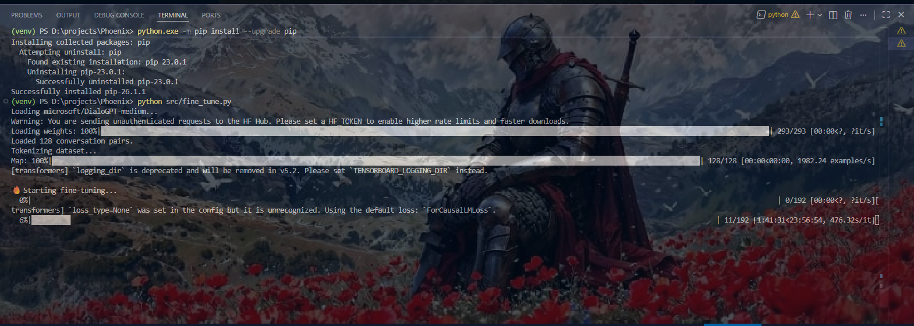

# 🔥 Phoenix
> *A long-term AI system designed to evolve toward human-like intelligence and real-world capability.*

---
## 🔥 Phoenix Training Update

<p align="center">
  
</p>


> Phoenix intensely staring at the training loss for 23 business hours straight while pretending everything is under control 🧠🔥

---

## 🧠 Overview

Phoenix is an AI system being built from scratch with the goal of developing a human-like intelligence that can think, learn, remember, and act.

Unlike typical AI projects that rely on external APIs, Phoenix focuses on understanding and building intelligence at the core level — step by step — from basic neural networks to advanced autonomous systems.

---

## 🔮 Vision

Phoenix aims to become an intelligent system capable of:

- 💬 Natural human-like communication
- 🧠 Learning from experience and adapting over time
- 🔁 Memory-driven reasoning and context awareness
- ⚙️ Performing tasks on devices (file system, apps, automation)
- 🤖 Interacting with physical systems (robotics, sensors, real-world actions)

The long-term goal is to create a unified AI that operates both as:
- a **software agent (on devices)**
- and a **physical agent (in robotics systems)**

---

## ⚡ Current Capabilities

- Natural conversation chatbot 💬
- LSTM seq2seq model with Attention mechanism 🧠
- Bidirectional encoder + attention decoder architecture 🔀
- Word2Vec pretrained embeddings 📐
- Custom dataset training pipeline 📊
- Short-term memory system (context-aware replies) 🔁
- **Real-time continuous learning** (live weight updates per conversation turn) ⚡
- Automatic dataset growth from approved conversations 📈
- **Emotion detection & tone adaptation** (sad, angry, anxious, happy, confused) 🎭
- **Long-term persistent memory** (SQLite — survives restarts, stores user facts) 🗄️
- **Smart response filtering** (6-stage quality pipeline, best-of-3 candidate selection) 🎯
- **Web UI** (dark terminal-aesthetic chat interface with emotion badges) 🌐
- One-click launch with auto data prep + training + browser open 🚀
- Fully local execution — no API dependency ⚙️

---

## 🛠️ Tech Stack

- Python 🐍
- PyTorch 🔥
- LSTM Seq2Seq + Bahdanau Attention
- Word2Vec (gensim)
- SQLite (long-term memory)
- Flask (web UI)
- Custom tokenizer & vocabulary system

---

## 🚀 Run Phoenix

```bash
pip install torch tqdm gensim flask datasets
python main.py
```

First run automatically:
1. Downloads & prepares training data
2. Trains the model
3. Launches the web UI
4. Opens your browser at `http://localhost:5000`

### Web UI Features

| Feature | Description |
|---------|-------------|
| 🎭 Emotion badge | Shows detected emotion in real time |
| 🟢 Learn dot | Green = Phoenix learned this turn, Red = rejected |
| 🧠 Facts panel | Click brain icon to see what Phoenix knows about you |
| 💬 Typing indicator | Animated indicator while Phoenix generates |

### CLI Commands (if using `inference.py` directly)

| Command | Action |
|---------|--------|
| `exit` | Quit and save model |
| `/reset` | Clear session memory |
| `/memory` | View recent conversation turns |
| `/save` | Manually save model checkpoint |
| `/stats` | Show memory DB stats and known facts |

---

## 📁 Project Structure

```
Phoenix/
├── main.py                  # One-click launcher (data → train → web UI → browser)
├── data/
│   ├── real_data.txt        # Training dataset (grows over time)
│   └── phoenix_memory.db   # Long-term memory (SQLite)
├── models/
│   └── phoenix.pt           # Saved model checkpoint
└── src/
    ├── dataset.py           # Tokenizer, vocab, encode/decode
    ├── model.py             # Encoder, Attention, Decoder, PhoenixModel
    ├── train.py             # Training loop with continuous learning support
    ├── inference.py         # Chat loop with emotion + memory + filtering
    ├── prepare_data.py      # Multi-source dataset downloader + seed data
    ├── emotion.py           # Emotion detection & temperature adaptation
    ├── memory.py            # SQLite long-term memory & fact extraction
    ├── filters.py           # 6-stage response quality filter
    └── web_ui.py            # Flask web interface
```

---

# 🧭 Phoenix — TODO

## 🧠 Core AI
- ✅ Basic neural network
- ✅ Training loop
- ✅ Inference system
- ✅ Text dataset support
- ✅ LSTM model
- ✅ Basic chatbot
- ✅ Seq2Seq architecture
- ✅ Attention mechanism
- ✅ Word2Vec embeddings
- ⬜ Transformer-based model (GPT-style)
- ⬜ Fine-tuning pipeline

---

## 💬 Conversation System
- ✅ Simple responses
- ✅ Full sentence generation
- ✅ Context-aware dialogue (memory-based context)
- ✅ Better response ranking (best-of-3 candidate scoring)
- ⬜ Beam search decoding

---

## 🧠 Memory System
- ✅ Short-term memory (conversation context)
- ✅ Long-term memory (SQLite database)
- ✅ Smart memory filtering (6-stage quality filter)
- ✅ Context-driven responses (profile + history injection)
- ⬜ Semantic memory search (retrieve relevant past turns)

---

## 🔁 Learning System
- ✅ Offline training loop
- ✅ Continuous learning (resume from checkpoint)
- ✅ Real-time online learning (live weight updates)
- ✅ Automatic dataset growth from conversations
- ⬜ Reinforcement learning (reward model)
- ⬜ Continuous learning without catastrophic forgetting (EWC)

---

## 🎭 Emotion & Personality
- ✅ Emotion detection (sad, angry, anxious, happy, confused, neutral)
- ✅ Temperature adaptation per emotion
- ✅ Tone-aware context injection
- ⬜ Personality system (persistent character traits)
- ⬜ Emotion simulation (Phoenix expresses its own state)
- ⬜ Mood tracking over time

---

## 🧹 NLP Improvements
- ✅ Word2Vec embeddings
- ⬜ Unknown word handling (subword tokenization)
- ⬜ Spelling correction
- ⬜ Tokenization upgrade (BPE / SentencePiece)
- ⬜ GloVe / BERT-style embeddings

---

## 📊 Data Pipeline
- ✅ Local seed dataset (always available, no internet)
- ✅ Automated dataset loader (DailyDialog, BlendedSkillTalk, Cornell)
- ✅ Data cleaning & preprocessing
- ✅ Multi-source fallback (tries mirrors, never fails silently)
- ⬜ Large-scale dataset integration
- ⬜ Synthetic data generation via LLM

---

## ⚙️ System Architecture
- ✅ Auto run (main.py)
- ✅ Auto data preparation
- ✅ Auto training on first run
- ✅ Auto browser launch
- ✅ Model versioning (best checkpoint saving)
- ⬜ Configuration system (config.yaml)
- ⬜ Logging & monitoring dashboard

---

## 🌐 Interface Layer
- ✅ Web UI (Flask, dark theme, emotion badges, facts panel)
- ✅ CLI chat interface
- ⬜ REST API (FastAPI)
- ⬜ Mobile app integration
- ⬜ Voice interface (speech-to-text + TTS)
- ⬜ Real-time streaming responses

---

## 🧩 Intelligence Features
- ✅ User fact extraction (name, age, location, job, preferences)
- ✅ Profile-aware responses
- ⬜ Goal-based task execution
- ⬜ Command interpretation system
- ⬜ Multi-turn reasoning

---

## 💻 Device Control (Software Agent)
- ⬜ File system control
- ⬜ App launching & automation
- ⬜ OS-level command execution
- ⬜ Task scheduling

---

## 🤖 Robotics Integration (Physical Agent)
- ⬜ Camera vision (object detection)
- ⬜ Speech input/output
- ⬜ Motor & actuator control
- ⬜ Sensor integration

---

## 🧠 Advanced Systems
- ⬜ Reinforcement learning
- ⬜ Multi-modal AI (text + image + audio)
- ⬜ Autonomous agent mode
- ⬜ Wake word ("Hey Phoenix")
- ⬜ Custom voice synthesis
- ⬜ Animated avatar