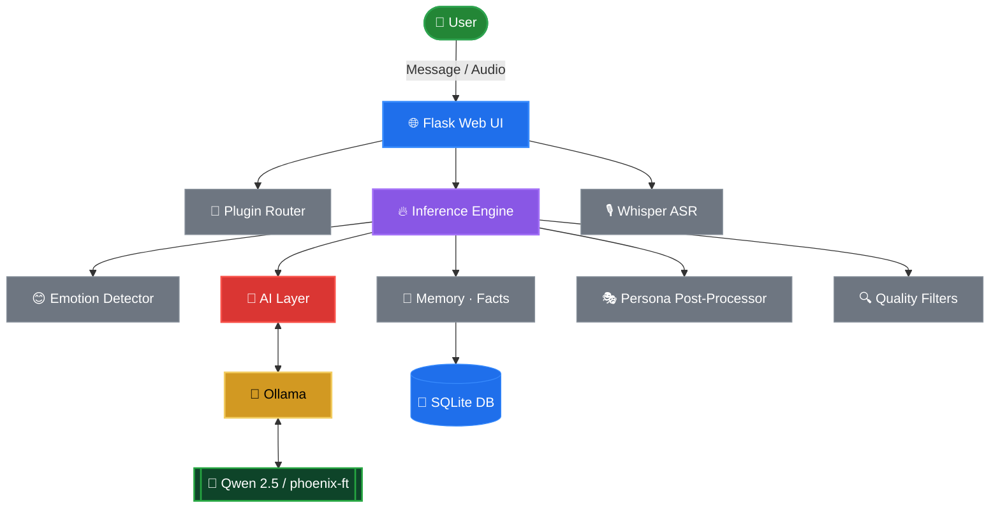

<div align="center">


```
██████╗ ██╗  ██╗ ██████╗ ███████╗███╗   ██╗██╗██╗  ██╗
██╔══██╗██║  ██║██╔═══██╗██╔════╝████╗  ██║██║╚██╗██╔╝
██████╔╝███████║██║   ██║█████╗  ██╔██╗ ██║██║ ╚███╔╝ 
██╔═══╝ ██╔══██║██║   ██║██╔══╝  ██║╚██╗██║██║ ██╔██╗ 
██║     ██║  ██║╚██████╔╝███████╗██║ ╚████║██║██╔╝ ██╗
╚═╝     ╚═╝  ╚═╝ ╚═════╝ ╚══════╝╚═╝  ╚═══╝╚═╝╚═╝  ╚═╝
```

### 🔥 Your Local AI Companion

*Chat. Feel. Remember. Connect.*

<br/>


<br/>

**No subscriptions. No cloud dependency. No API bills.**

Powered entirely by local AI models through Ollama.

<br/>

</div>

---

<div align="center">

## 🟣 Overview

</div>

Phoenix is an open-source, emotionally intelligent AI companion that runs **100% on your machine** using local language models. It remembers who you are, detects how you feel, and responds with a consistent human-like personality — powered by Qwen through Ollama.

No accounts. No API keys. No monthly bills. No telemetry. **Just conversation.**

---

<div align="center">

## ✨ Features

</div>

<table>
<tr>
<td width="50%">

**🤖 Local AI Engine**
- Powered by Ollama + Qwen
- Fully offline capable
- Zero API keys or usage limits
- Privacy-first by design
- Hot-swap models via env var

**🧠 Emotion Intelligence**
- Detects sad, happy, angry, anxious, confused
- Adjusts tone and temperature per emotion
- Tone hints injected into every prompt
- Persona post-processor for natural voice

**💬 Persistent Memory**
- SQLite-backed conversation history
- Fact extraction (name, age, location, job)
- Per-session context injection
- Profile string built automatically

</td>
<td width="50%">

**🎭 Phoenix Personality**
- Natural filler openers per emotion
- Thinking pauses on mid-length replies
- Light follow-up hooks (28% of replies)
- Consistent voice regardless of backend

**🌐 Web UI**
- Flask server + 3D cyber samurai frontend
- Three.js GLB model rendering
- Live `/status`, `/facts`, `/stats` endpoints
- Multi-user isolated sessions

**🔌 Plugin System**
- Drop `.py` files into `plugins/` to add commands
- Built-in `/joke`, `/calc`, `/remind`
- Full session context available to plugins
- Hot-list via `/plugins` endpoint

</td>
</tr>
</table>

---

<div align="center">

## 🚀 Quick Start

</div>

### 1 · Install Ollama

```bash
# macOS / Linux
curl -fsSL https://ollama.ai/install.sh | sh
ollama serve
```

### 2 · Pull a model

```bash
# Recommended — fast, great quality
ollama pull qwen2.5

# Larger variants for better reasoning
ollama pull qwen2.5:14b
ollama pull qwen2.5:72b
```

### 3 · Install Phoenix

```bash
git clone https://github.com/youruser/phoenix.git
cd phoenix
pip install -r requirements.txt
```

### 4 · Run

```bash
python main.py
```

```
╔══════════════════════════════════════════╗
║           Phoenix AI  –  Ollama           ║
╚══════════════════════════════════════════╝
  Backend : http://localhost:11434
  Model   : qwen2.5

✅ Model 'qwen2.5' ready.
🔌 Plugins: /joke, /calc, /remind
🚀 Starting Phoenix Web UI...
   Visit: http://localhost:5000
```

---

<div align="center">

## 💬 Usage

</div>

### Just talk

```
You: hey, I'm feeling really stressed about work
Phoenix 😊: Hey, it's okay. One step at a time — what's going on exactly?

You: my name is Alex and I live in Mumbai
Phoenix: Got it. Nice to meet you, Alex! What's on your mind?

You: what is my name?
Phoenix: Your name is Alex.
```

### CLI commands

```
/reset      Clear session memory
/memory     View recent conversation turns
/facts      Show all extracted user facts
/stats      Database statistics
exit        Quit Phoenix
```

### Plugin commands

```
/joke                              Get a random joke
/calc (12 * 3) / sqrt(9)          Evaluate a math expression
/remind dentist tomorrow at 6pm   Save a reminder
/remind list                       View all reminders
/remind clear                      Clear all reminders
```

### Voice input *(requires faster-whisper)*

```bash
pip install faster-whisper

# Send a recorded audio file
curl -X POST http://localhost:5000/voice -F "audio=@recording.wav"
```

Response includes both the transcript and Phoenix's reply:
```json
{
  "transcript": "hey how are you",
  "reply": "I'm doing well! What's on your mind?",
  "emotion": "neutral"
}
```

---

<div align="center">

## 🔧 Configuration

</div>

Override defaults via environment variables:

| Variable | Default | Description |
|:---------|:--------|:------------|
| `OLLAMA_HOST` | `http://localhost:11434` | Ollama server URL |
| `OLLAMA_MODEL` | `qwen2.5` | Model tag (any Qwen variant) |
| `PHOENIX_SECRET` | *(random)* | Flask session secret key |
| `WHISPER_MODEL` | `tiny` | Whisper model size for voice input |

```bash
OLLAMA_MODEL=qwen2.5:14b python main.py
```

---

<div align="center">

## 🤖 Supported Models

</div>

| Model | Best For | Size |
|:------|:---------|:-----|
| `qwen2.5` ⭐ | Conversation, general use | ~4 GB |
| `qwen2.5:14b` ⭐ | Better reasoning + empathy | ~9 GB |
| `qwen2.5:72b` | Best quality responses | ~45 GB |
| `phoenix-ft` | Fine-tuned on your conversations | same as base |
| Any Ollama model | Custom use cases | varies |

Any Ollama-compatible model works — Qwen variants are recommended for the conversational style Phoenix is tuned for.

---

<div align="center">

## 🧠 Memory System

</div>

All session data is stored locally inside your project:

```
data/
├── phoenix_memory.db    # Conversations · facts · sessions (SQLite)
├── real_data.txt        # Auto-logged quality exchanges for fine-tuning
└── reminders.json       # Plugin-saved reminders
```

Facts Phoenix learns about you:

```
name · age · location · job · favourite_[anything] · likes · dislikes
```

Memory never leaves your machine.

---

<div align="center">

## 🎭 Personality Pipeline

</div>

Every reply passes through the Phoenix persona post-processor regardless of which model generated it:

```
Raw model output
      ↓
  Emotion-keyed filler opener   ("I hear you. " / "Oh wow, " / "Hmm… ")
      ↓
  Thinking pause  (25% chance on mid-length replies)
      ↓
  Follow-up hook  (28% chance if reply doesn't end with "?")
      ↓
  Phoenix reply ✨
```

---

<div align="center">

## 🔌 Plugin System

</div>

Drop any `.py` file into the `plugins/` folder — Phoenix loads it automatically on startup.

```python
# plugins/greet.py
COMMAND     = "greet"
DESCRIPTION = "Greet someone by name"
USAGE       = "/greet <name>"

def run(args: str, session_id: str = None) -> str:
    name = args.strip() or "friend"
    return f"Hey {name}! 👋 Great to meet you."
```

Then in Phoenix:
```
You: /greet Alex
Phoenix: Hey Alex! 👋 Great to meet you.
```

**Built-in plugins:**

| Command | Description |
|:--------|:------------|
| `/joke` | Random programming / AI joke |
| `/calc <expr>` | Safe math evaluator — supports `sqrt`, `sin`, `log`, `pi` |
| `/remind <text>` | Save a reminder to `data/reminders.json` |
| `/remind list` | View all saved reminders |
| `/remind clear` | Clear all reminders |

---

<div align="center">

## 🎙️ Voice Input

</div>

Phoenix accepts audio via the `/voice` endpoint and transcribes it locally using [faster-whisper](https://github.com/SYSTRAN/faster-whisper) — no cloud, no API key.

```bash
# Install
pip install faster-whisper

# Send audio (WAV or WebM)
curl -X POST http://localhost:5000/voice -F "audio=@recording.wav"
```

Control the transcription model size via `WHISPER_MODEL`:

| Value | RAM | Speed | Accuracy |
|:------|:----|:------|:---------|
| `tiny` *(default)* | ~400 MB | Fastest | Good |
| `base` | ~500 MB | Fast | Better |
| `small` | ~1 GB | Medium | Best for local |

```bash
WHISPER_MODEL=small python main.py
```

---

<div align="center">

## 🔁 Fine-Tune Pipeline

</div>

After chatting with Phoenix, your best conversations are saved to `data/real_data.txt`. Use the fine-tune pipeline to bake them into a custom Ollama model:

```bash
# Check how many pairs you have
python fine_tune_ollama.py --status

# Build your fine-tuned model  (creates 'phoenix-ft' in Ollama)
python fine_tune_ollama.py

# Run Phoenix with your fine-tuned model
OLLAMA_MODEL=phoenix-ft python main.py
```

Options:

```bash
python fine_tune_ollama.py --data data/real_data.txt \
                           --model qwen2.5:14b \
                           --out phoenix-ft-v2 \
                           --max 40
```

---

<div align="center">

## 📋 API Endpoints

</div>

| Endpoint | Method | Description |
|:---------|:-------|:------------|
| `/` | GET | Web UI frontend |
| `/chat` | POST | Send a message, get a reply |
| `/voice` | POST | Send audio, get transcript + reply |
| `/status` | GET | Ollama + model + plugin health check |
| `/plugins` | GET | List all loaded plugin commands |
| `/facts` | GET | All extracted user facts |
| `/stats` | GET | Memory database statistics |
| `/memory` | GET | Recent conversation turns |
| `/history` | GET | Full session history |
| `/reset_session` | POST | Clear current session memory |
| `/save` | POST | No-op (Ollama manages weights) |

---

<div align="center">

## 🧱 Project Structure

</div>

```
Phoenix/
│
├── src/
│   ├── inference.py          # Ollama/Qwen backend · persona · respond()
│   ├── emotion.py            # Emotion detection · temperature · tone hints
│   ├── memory.py             # SQLite memory · fact extraction · sessions
│   ├── filters.py            # Reply quality gates · scoring
│   ├── web_ui.py             # Flask server · all API routes · plugin loader
│   ├── model.py              # Legacy LSTM model definition (kept)
│   ├── dataset.py            # Dataset utilities (kept)
│   ├── train.py              # LSTM training script (kept)
│   └── fine_tune.py          # Transformer fine-tuning script (kept)
│
├── plugins/                  # Drop .py files here to add slash commands
│   ├── joke.py               # /joke
│   ├── calc.py               # /calc
│   ├── remind.py             # /remind
│   └── README.md             # How to write your own plugins
│
├── frontend/
│   ├── index.html            # Main UI (Three.js · 3D samurai)
│   ├── script.js             # Chat logic · WebGL setup
│   ├── style.css             # UI styles
│   └── assets/
│       └── 3dModel/
│           └── cyber_samurai.glb
│
├── data/
│   ├── phoenix_memory.db     # SQLite memory store
│   ├── real_data.txt         # Auto-logged training pairs
│   └── reminders.json        # Plugin reminders
│
├── models/                   # Legacy model weights (kept)
│   └── phoenix_transformer/
│
├── main.py                   # Launcher · pre-flight · open browser
├── fine_tune_ollama.py       # Fine-tune pipeline (Modelfile approach)
├── requirements.txt          # flask · requests  (faster-whisper optional)
└── README.md
```

---

<div align="center">

## 🏗 Architecture

</div>



---

<div align="center">

## 🛣️ Roadmap

</div>

### Phase 1 — Core ✅
- 🟣 Custom LSTM dialogue model
- 🟣 Emotion detection + tone adaptation
- 🟣 SQLite memory + fact extraction
- 🟣 Phoenix voice persona post-processor

### Phase 2 — Intelligence ✅
- 🟣 Fine-tuned transformer (DialoGPT-based)
- 🟣 Quality filter pipeline + response scoring
- 🟣 Online learning from approved conversations
- 🟣 Dataset auto-logging

### Phase 3 — Web UI ✅
- 🟣 Flask API server
- 🟣 3D cyber samurai frontend (Three.js)
- 🟣 Session management + history endpoints

### Phase 4 — Ollama Migration ✅
- 🟣 Qwen 2.5 via Ollama replaces LSTM/transformer
- 🟣 Memory + persona + filters all preserved
- 🟣 Hot-swap any Ollama model via env var

### Phase 5 — Studio ✅
- 🟣 Voice input via local Whisper (`/voice` endpoint)
- 🟣 Multi-user isolated sessions (Flask cookie-based)
- 🔲 Desktop Electron UI *(planned)*

### Phase 6 — Ecosystem ✅
- 🟣 Plugin system (`plugins/` folder · `/joke` `/calc` `/remind`)
- 🟣 Fine-tune pipeline on accumulated `real_data.txt`
- 🔲 Mobile companion app *(planned)*

---

<div align="center">

## 🔒 Privacy

</div>

| Principle | Detail |
|:----------|:-------|
| 🔒 Zero telemetry | No analytics, no tracking, no crash reports |
| 🏠 Local inference | All AI runs via Ollama on your machine |
| 🎙️ Local transcription | Voice processed by Whisper — never sent to cloud |
| 💾 Local storage | `data/` in your project — never synced |
| 👁️ Open source | Audit every line |
| ✈️ Offline capable | Works with no internet connection |

---

<div align="center">

## 🛠️ What Changed

</div>

| File | Change |
|:-----|:-------|
| `src/inference.py` | `chat_step()` accepts `session_id` for per-user isolation |
| `src/web_ui.py` | Multi-user sessions · `/voice` endpoint · plugin loader · `/plugins` route |
| `plugins/joke.py` | New — `/joke` command |
| `plugins/calc.py` | New — `/calc` safe math evaluator |
| `plugins/remind.py` | New — `/remind` save · list · clear |
| `fine_tune_ollama.py` | New — Modelfile-based fine-tune pipeline |
| `main.py` | Shows plugins + voice status on startup |
| `requirements.txt` | Voice dep documented (opt-in) |

---

<div align="center">

## 🤝 Contributing

</div>

Contributions, bug reports, and pull requests are welcome.

1. Fork the repository
2. Create a feature branch: `git checkout -b feat/my-feature`
3. Make your changes
4. Submit a pull request

---

<div align="center">


Built by **~Vin 💜**

**Phoenix — Your Local AI Companion**

*MIT License · Open Source · Local First · Privacy Focused*

</div>