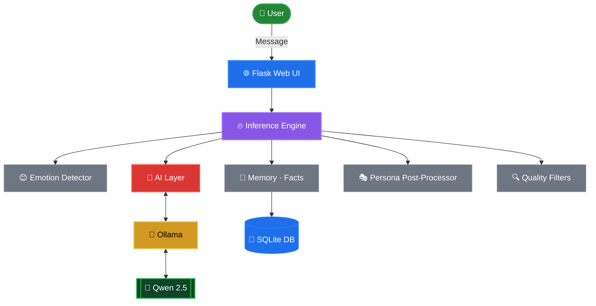

# Phoenix AI — Ollama / Qwen Backend

> **Migration note:** The LSTM + fine-tuned transformer pipeline has been
> replaced with a locally-running [Ollama](https://ollama.com) server using
> the **Qwen 2.5** model family.  All other Phoenix systems are unchanged:
> emotion detection, memory (SQLite), persona post-processing, dataset
> logging, and the web UI.

---

## Quick-start

```bash
# 1. Install Ollama  (https://ollama.com/download)
#    macOS:   brew install ollama
#    Linux:   curl -fsSL https://ollama.com/install.sh | sh

# 2. Pull the model (run once)
ollama pull qwen2.5          # ~4 GB — fast, great quality
# Or a larger variant:
# ollama pull qwen2.5:14b
# ollama pull qwen2.5:72b

# 3. Make sure Ollama is running
ollama serve                 # keep this terminal open (or it auto-starts on macOS)

# 4. Install Python deps
pip install -r requirements.txt

# 5. Launch Phoenix
python main.py               # opens http://localhost:5000 automatically
```

---

## Configuration

Override defaults via environment variables:

| Variable       | Default                   | Description                       |
|----------------|---------------------------|-----------------------------------|
| `OLLAMA_HOST`  | `http://localhost:11434`  | Ollama server URL                 |
| `OLLAMA_MODEL` | `qwen2.5`                 | Model tag (any Qwen variant works) |

```bash
OLLAMA_MODEL=qwen2.5:14b python main.py
```

---

## What changed

| File                   | Change                                                                 |
|------------------------|------------------------------------------------------------------------|
| `src/inference.py`     | **Replaced** — now calls Ollama `/api/chat` instead of LSTM/transformer |
| `src/web_ui.py`        | `/status` endpoint updated to report Ollama readiness                  |
| `main.py`              | Removed dataset/training bootstrap; added Ollama pre-flight check      |
| `requirements.txt`     | Replaced PyTorch / HuggingFace deps with `flask` + `requests`          |

All other files (`emotion.py`, `memory.py`, `filters.py`, `dataset.py`,
`train.py`, `fine_tune.py`, frontend) are **untouched**.

---

## Memory & personality

Phoenix still:
- Detects emotion and adjusts tone automatically
- Saves facts about you (name, age, location …) in `data/phoenix_memory.db`
- Applies the Phoenix voice persona (fillers, continuations, thinking pauses)
- Logs good conversations to `data/real_data.txt` for future fine-tuning

---

## Switching models

Any Ollama-supported model works.  Qwen variants recommended for quality:

```bash
ollama pull qwen2.5          # default – 4 GB, fast
ollama pull qwen2.5:14b      # better reasoning – 9 GB
ollama pull qwen2.5:72b      # best quality – 45 GB
```

Then launch with:
```bash
OLLAMA_MODEL=qwen2.5:14b python main.py
```
<div align="center">


```
██████╗ ██╗  ██╗ ██████╗ ███████╗███╗   ██╗██╗██╗  ██╗
██╔══██╗██║  ██║██╔═══██╗██╔════╝████╗  ██║██║╚██╗██╔╝
██████╔╝███████║██║   ██║█████╗  ██╔██╗ ██║██║ ╚███╔╝ 
██╔═══╝ ██╔══██║██║   ██║██╔══╝  ██║╚██╗██║██║ ██╔██╗ 
██║     ██║  ██║╚██████╔╝███████╗██║ ╚████║██║██╔╝ ██╗
╚═╝     ╚═╝  ╚═╝ ╚═════╝ ╚══════╝╚═╝  ╚═══╝╚═╝╚═╝  ╚═╝
```

### 🔥 Your Local AI Companion

*Chat. Feel. Remember. Connect.*

<br/>


<br/>

**No subscriptions. No cloud dependency. No API bills.**

Powered entirely by local AI models through Ollama.

<br/>

</div>

---

<div align="center">

## 🟣 Overview

</div>

Phoenix is an open-source, emotionally intelligent AI companion that runs **100% on your machine** using local language models. It remembers who you are, detects how you feel, and responds with a consistent human-like personality — powered by Qwen through Ollama.

No accounts. No API keys. No monthly bills. No telemetry. **Just conversation.**

---

<div align="center">

## ✨ Features

</div>

<table>
<tr>
<td width="50%">

**🤖 Local AI Engine**
- Powered by Ollama + Qwen
- Fully offline capable
- Zero API keys or usage limits
- Privacy-first by design
- Hot-swap models via env var

**🧠 Emotion Intelligence**
- Detects sad, happy, angry, anxious, confused
- Adjusts tone and temperature per emotion
- Tone hints injected into every prompt
- Persona post-processor for natural voice

**💬 Persistent Memory**
- SQLite-backed conversation history
- Fact extraction (name, age, location, job)
- Per-session context injection
- Profile string built automatically

</td>
<td width="50%">

**🎭 Phoenix Personality**
- Natural filler openers per emotion
- Thinking pauses on mid-length replies
- Light follow-up hooks (28% of replies)
- Consistent voice regardless of backend

**🌐 Web UI**
- Flask server + 3D cyber samurai frontend
- Three.js GLB model rendering
- Live `/status`, `/facts`, `/stats` endpoints
- Session reset and history viewing

**🔁 Dataset Logging**
- Good conversations auto-saved to `real_data.txt`
- Quality filter gates before logging
- Foundation for future fine-tuning runs

</td>
</tr>
</table>

---

<div align="center">

## 🚀 Quick Start

</div>

### 1 · Install Ollama

```bash
# macOS / Linux
curl -fsSL https://ollama.ai/install.sh | sh
ollama serve
```

### 2 · Pull a model

```bash
# Recommended — fast, great quality
ollama pull qwen2.5

# Larger variants for better reasoning
ollama pull qwen2.5:14b
ollama pull qwen2.5:72b
```

### 3 · Install Phoenix

```bash
git clone https://github.com/youruser/phoenix.git
cd phoenix
pip install -r requirements.txt
```

### 4 · Run

```bash
python main.py
```

```
╔══════════════════════════════════════════╗
║           Phoenix AI  –  Ollama           ║
╚══════════════════════════════════════════╝
  Backend : http://localhost:11434
  Model   : qwen2.5

✅ Model 'qwen2.5' ready.
🚀 Starting Phoenix Web UI...
   Visit: http://localhost:5000
```

---

<div align="center">

## 💬 Usage

</div>

### Just talk

```
You: hey, I'm feeling really stressed about work
Phoenix 😊: Hey, it's okay. One step at a time — what's going on exactly?

You: my name is Alex and I live in Mumbai
Phoenix: Got it. Nice to meet you, Alex! What's on your mind?

You: what is my name?
Phoenix: Your name is Alex.
```

### CLI commands

```
/reset      Clear session memory
/memory     View recent conversation turns
/facts      Show all extracted user facts
/stats      Database statistics
exit        Quit Phoenix
```

---

<div align="center">

## 🔧 Configuration

</div>

Override defaults via environment variables:

| Variable | Default | Description |
|:---------|:--------|:------------|
| `OLLAMA_HOST` | `http://localhost:11434` | Ollama server URL |
| `OLLAMA_MODEL` | `qwen2.5` | Model tag (any Qwen variant) |

```bash
OLLAMA_MODEL=qwen2.5:14b python main.py
```

---

<div align="center">

## 🤖 Supported Models

</div>

| Model | Best For | Size |
|:------|:---------|:-----|
| `qwen2.5` ⭐ | Conversation, general use | ~4 GB |
| `qwen2.5:14b` ⭐ | Better reasoning + empathy | ~9 GB |
| `qwen2.5:72b` | Best quality responses | ~45 GB |
| Any Ollama model | Custom use cases | varies |

Any Ollama-compatible model works — Qwen variants are recommended for the conversational style Phoenix is tuned for.

---

<div align="center">

## 🧠 Memory System

</div>

All session data is stored locally inside your project:

```
data/
├── phoenix_memory.db    # Conversations · facts · sessions (SQLite)
└── real_data.txt        # Auto-logged quality exchanges for fine-tuning
```

Facts Phoenix learns about you:

```
name · age · location · job · favourite_[anything]· likes · dislikes
```

Memory never leaves your machine.

---

<div align="center">

## 🎭 Personality Pipeline

</div>

Every reply passes through the Phoenix persona post-processor regardless of which model generated it:

```
Raw model output
      ↓
  Emotion-keyed filler opener   ("I hear you. " / "Oh wow, " / "Hmm… ")
      ↓
  Thinking pause  (25% chance on mid-length replies)
      ↓
  Follow-up hook  (28% chance if reply doesn't end with "?")
      ↓
  Phoenix reply ✨
```

---

<div align="center">

## 📋 API Endpoints

</div>

| Endpoint | Method | Description |
|:---------|:-------|:------------|
| `/` | GET | Web UI frontend |
| `/chat` | POST | Send a message, get a reply |
| `/status` | GET | Ollama + model health check |
| `/facts` | GET | All extracted user facts |
| `/stats` | GET | Memory database statistics |
| `/memory` | GET | Recent conversation turns |
| `/history` | GET | Full session history |
| `/reset_session` | POST | Clear current session memory |
| `/save` | POST | No-op (Ollama manages weights) |

---

<div align="center">

## 🧱 Project Structure

</div>

```
Phoenix/
│
├── src/
│   ├── inference.py        # Ollama/Qwen backend · persona · respond()
│   ├── emotion.py          # Emotion detection · temperature · tone hints
│   ├── memory.py           # SQLite memory · fact extraction · sessions
│   ├── filters.py          # Reply quality gates · scoring
│   ├── web_ui.py           # Flask server · all API routes
│   ├── model.py            # Legacy LSTM model definition (kept)
│   ├── dataset.py          # Dataset utilities (kept for fine-tuning)
│   ├── train.py            # LSTM training script (kept)
│   └── fine_tune.py        # Transformer fine-tuning script (kept)
│
├── frontend/
│   ├── index.html          # Main UI (Three.js · 3D samurai)
│   ├── script.js           # Chat logic · WebGL setup
│   ├── style.css           # UI styles
│   └── assets/
│       └── 3dModel/
│           └── cyber_samurai.glb
│
├── data/
│   ├── phoenix_memory.db   # SQLite memory store
│   └── real_data.txt       # Auto-logged training pairs
│
├── models/                 # Legacy model weights (kept)
│   └── phoenix_transformer/
│
├── main.py                 # Launcher · Ollama pre-flight · open browser
├── requirements.txt        # flask · requests
└── README.md
```

---

<div align="center">

## 🏗 Architecture

</div>



---

<div align="center">

## 🛣️ Roadmap

</div>

### Phase 1 — Core ✅
- 🟣 Custom LSTM dialogue model
- 🟣 Emotion detection + tone adaptation
- 🟣 SQLite memory + fact extraction
- 🟣 Phoenix voice persona post-processor

### Phase 2 — Intelligence ✅
- 🟣 Fine-tuned transformer (DialoGPT-based)
- 🟣 Quality filter pipeline + response scoring
- 🟣 Online learning from approved conversations
- 🟣 Dataset auto-logging

### Phase 3 — Web UI ✅
- 🟣 Flask API server
- 🟣 3D cyber samurai frontend (Three.js)
- 🟣 Session management + history endpoints

### Phase 4 — Ollama Migration ✅
- 🟣 Qwen 2.5 via Ollama replaces LSTM/transformer
- 🟣 Memory + persona + filters all preserved
- 🟣 Hot-swap any Ollama model via env var

### Phase 5 — Studio ⚡ In Progress
- 🔲 Desktop Electron UI
- 🔲 Voice input (local Whisper)
- 🔲 Multi-user session support

### Phase 6 — Ecosystem ⚡ Planned
- 🔲 Plugin system
- 🔲 Fine-tune pipeline on accumulated `real_data.txt`
- 🔲 Mobile companion app

---

<div align="center">

## 🔒 Privacy

</div>

| Principle | Detail |
|:----------|:-------|
| 🔒 Zero telemetry | No analytics, no tracking, no crash reports |
| 🏠 Local inference | All AI runs via Ollama on your machine |
| 💾 Local storage | `data/` in your project — never synced |
| 👁️ Open source | Audit every line |
| ✈️ Offline capable | Works with no internet connection |

---

<div align="center">

## 🛠️ What Changed (Ollama Migration)

</div>

| File | Change |
|:-----|:-------|
| `src/inference.py` | **Replaced** — calls Ollama `/api/chat` instead of LSTM/transformer |
| `src/web_ui.py` | `/status` endpoint updated to report Ollama readiness |
| `main.py` | Removed training bootstrap; added Ollama pre-flight check |
| `requirements.txt` | Replaced PyTorch / HuggingFace with `flask` + `requests` |

All other files (`emotion.py`, `memory.py`, `filters.py`, `train.py`, `fine_tune.py`, frontend) are **untouched**.

---

<div align="center">

## 🤝 Contributing

</div>

Contributions, bug reports, and pull requests are welcome.

1. Fork the repository
2. Create a feature branch: `git checkout -b feat/my-feature`
3. Make your changes
4. Submit a pull request

---

<div align="center">


Built by **~Vin 💜**

**Phoenix — Your Local AI Companion**

*MIT License · Open Source · Local First · Privacy Focused*

</div>